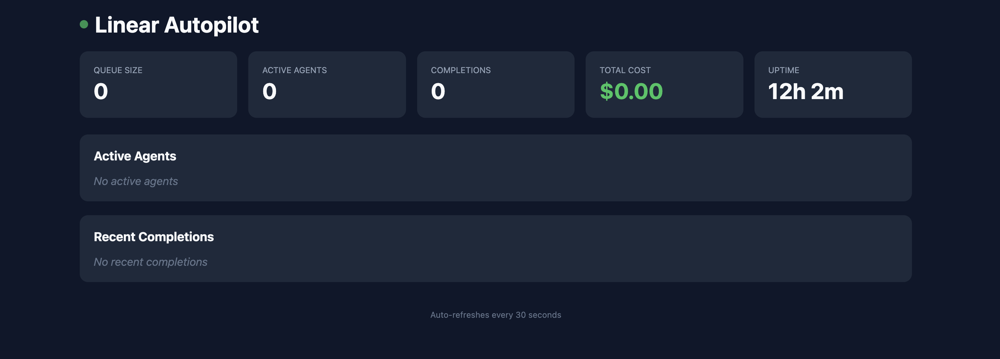

# Linear Autopilot

Autonomous AI agents that implement your Linear tickets while you sleep.



Linear Autopilot watches your Linear board for tickets labeled `agent-ready`, spawns Claude Code agents to implement them, runs validation, creates pull requests, and notifies your team—all automatically.

## Features

- **Autonomous Implementation** — Claude Code agents work on tickets end-to-end: read requirements, write code, run tests, commit changes
- **Multi-Tenant Support** — Manage multiple teams and repositories from a single instance
- **Validation Pipeline** — Automatically runs tests, linting, type checking, and coverage checks before creating PRs
- **Smart Retries** — Failed tickets are requeued with exponential backoff (up to 3 attempts)
- **Real-Time Dashboard** — Monitor queue, active agents, completions, and costs at a glance
- **Flexible Notifications** — Slack, Discord, Email, SMS, WhatsApp, or Google Chat alerts
- **Cost Tracking** — Track token usage and estimated costs per ticket
- **Rate Limiting** — Built-in rate limiting and retry logic for Linear API
- **Structured Logging** — JSON logs with context for easy debugging and monitoring
- **Docker Ready** — Deploy anywhere with included Dockerfile and docker-compose

## How It Works

```
┌─────────────┐     ┌─────────────┐     ┌─────────────┐     ┌─────────────┐
│   Linear    │────▶│  Autopilot  │────▶│ Claude Code │────▶│   GitHub    │
│  (webhook)  │     │  (spawner)  │     │   (agent)   │     │    (PR)     │
└─────────────┘     └─────────────┘     └─────────────┘     └─────────────┘
                           │
                           ▼
                    ┌─────────────┐
                    │ Validation  │
                    │ (test/lint) │
                    └─────────────┘
```

1. Add the `agent-ready` label to a Linear ticket
2. Autopilot picks up the ticket via webhook or polling
3. A Claude Code agent implements the changes on a feature branch
4. Validation runs (tests, lint, typecheck, coverage)
5. If validation passes, a PR is created and the ticket moves to "In Review"
6. Your team gets notified via your configured channels

## Quick Start

### Prerequisites

- Node.js 20+
- [Claude Code CLI](https://github.com/anthropics/claude-code) installed and authenticated
- [GitHub CLI](https://cli.github.com/) (`gh`) authenticated
- Linear API key

### Installation

```bash
git clone https://github.com/carolyndriscoll-trilogy/linear-autopilot.git
cd linear-autopilot
npm install
```

### Configuration

1. **Create environment file:**

```bash
cp .env.example .env
```

2. **Edit `.env` with your credentials:**

```env
LINEAR_API_KEY=lin_api_xxxxx
GITHUB_TOKEN=ghp_xxxxx
LINEAR_WEBHOOK_SECRET=your_webhook_secret  # Optional
LINEAR_POLLING_INTERVAL_MS=30000           # Use polling instead of webhooks
```

3. **Create `tenants.json`:**

```json
{
  "tenants": [
    {
      "name": "my-team",
      "linearTeamId": "your-linear-team-id",
      "repoPath": "/path/to/your/repo",
      "maxConcurrentAgents": 2,
      "githubRepo": "org/repo-name",
      "notifications": [
        {
          "type": "slack",
          "config": {
            "webhookUrl": "https://hooks.slack.com/services/xxx"
          }
        }
      ]
    }
  ]
}
```

### Running

```bash
# Development
npm run dev

# Production
npm run build
npm start
```

Open http://localhost:3000/dashboard to view the dashboard.

## Configuration

### Environment Variables

| Variable                     | Description                          | Default  |
| ---------------------------- | ------------------------------------ | -------- |
| `LINEAR_API_KEY`             | Linear API key (required)            | -        |
| `LINEAR_WEBHOOK_SECRET`      | Webhook signature secret             | -        |
| `LINEAR_POLLING_INTERVAL_MS` | Polling interval (0 = webhooks only) | `0`      |
| `GITHUB_TOKEN`               | GitHub token for PR creation         | -        |
| `PORT`                       | Server port                          | `3000`   |
| `LOG_LEVEL`                  | Log level (debug/info/warn/error)    | `info`   |
| `LOG_FILE`                   | Optional log file path               | -        |
| `COVERAGE_THRESHOLD`         | Minimum coverage % required          | `0`      |
| `AGENT_STUCK_THRESHOLD_MS`   | Stuck detection threshold            | `600000` |

### Tenant Configuration

Each tenant in `tenants.json` supports:

| Field                 | Description                         |
| --------------------- | ----------------------------------- |
| `name`                | Display name for the tenant         |
| `linearTeamId`        | Linear team ID                      |
| `repoPath`            | Absolute path to the repository     |
| `maxConcurrentAgents` | Max parallel agents for this tenant |
| `githubRepo`          | GitHub repo in `org/repo` format    |
| `notifications`       | Array of notification configs       |

### Notification Providers

```json
// Slack
{ "type": "slack", "config": { "webhookUrl": "https://hooks.slack.com/..." } }

// Discord
{ "type": "discord", "config": { "webhookUrl": "https://discord.com/api/webhooks/..." } }

// Email (Resend)
{ "type": "email", "config": { "provider": "resend", "apiKey": "re_xxx", "to": "team@example.com" } }

// SMS (Twilio)
{ "type": "sms", "config": { "accountSid": "AC...", "authToken": "...", "from": "+1...", "to": "+1..." } }

// Google Chat
{ "type": "gchat", "config": { "webhookUrl": "https://chat.googleapis.com/..." } }
```

## API Endpoints

| Endpoint                    | Description              |
| --------------------------- | ------------------------ |
| `GET /health`               | Health check with status |
| `GET /dashboard`            | Web dashboard            |
| `GET /dashboard/api/status` | JSON status overview     |
| `GET /dashboard/api/agents` | Active agent details     |
| `GET /dashboard/api/costs`  | Cost records             |
| `GET /dashboard/api/queue`  | Queued tickets           |
| `POST /webhook/linear`      | Linear webhook endpoint  |

## Development

### Running Tests

```bash
npm test                    # Run all tests
npm run test:watch          # Watch mode
npm run test:coverage       # With coverage report
```

### Code Quality

```bash
npm run lint                # Run ESLint
npm run typecheck           # TypeScript type checking
npm run format              # Format with Prettier
```

Coverage threshold is set to **70%** for statements, branches, functions, and lines.

See [CONTRIBUTING.md](CONTRIBUTING.md) for contribution guidelines.

## Deployment

See [DEPLOYMENT.md](DEPLOYMENT.md) for detailed instructions on deploying to:

- Docker (local)
- Railway
- Fly.io

### Quick Docker Start

```bash
docker-compose up -d
```

## Project Structure

```
src/
├── config/          # Environment and tenant configuration
├── dashboard/       # Web dashboard and API
├── linear/          # Linear API client with rate limiting
├── logger/          # Structured JSON logging
├── memory/          # Cross-session learning storage
├── notifications/   # Multi-provider notification system
├── prompts/         # Agent prompt templates
├── server/          # Express server and webhooks
├── spawner/         # Agent pool and queue management
├── tracking/        # Cost and token tracking
├── validation/      # Test/lint/typecheck pipeline
└── watcher/         # Webhook and polling handlers
```

## Validation Pipeline

Before creating a PR, Autopilot runs:

1. **Tests** — `npm test`
2. **Linting** — `npm run lint` (if script exists)
3. **Type Check** — `npx tsc --noEmit` (if tsconfig.json exists)
4. **Coverage** — Checks against `COVERAGE_THRESHOLD` (if set)

If any step fails, the ticket is moved back to Backlog with an error comment.

## Cost Tracking

Autopilot tracks token usage from Claude Code output and estimates costs:

- Stored in `.linear-autopilot/costs.json` per repository
- Visible in the dashboard
- Available via `/dashboard/api/costs`

## License

MIT

---

Built with [Claude Code](https://github.com/anthropics/claude-code)
